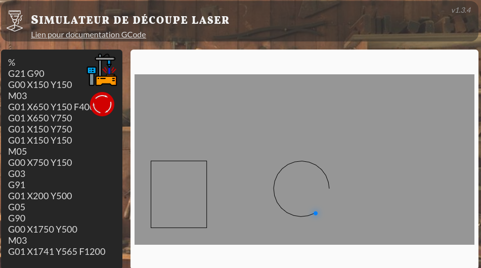

# SuperGrave

Simulateur de graveur laser 2D.

Les dimensions et paramètres sont basés sur les spécifications des modèles
 * Dener FL-3015-S
 * SCULPFUN S30 Pro Max avec options d'extension sur les axes X et Y ([cf. site du fabricant](https://sculpfun.com/collections/sculpfun-s30/products/sculpfun-s30-pro-max-automatic-air-assist-laser-engraver-machine-20w?variant=42446149877938)).

Démo ici : <https://laser.nsix.fr/>

## GCode

Pour l'utilisation du G-Code, une très bonne explication ici : <http://linuxcnc.org/docs/html/gcode/gcode_fr.html>.

## Versions
 * v1.4.0: ajout d'une vérification des paramètres GCode
 * v1.3.2: ajout raccourci CTRL+Enter
 * v1.0.3: plusieurs commandes par ligne acceptées.
 * v1.0.2: prise en compte des commandes G10 L2, G54 à G59.
 * v1.0.1: correction mise en surbrillance des commandes pendant l'exécution.
 * **v1.0.0** : remplacement du code simplifié par du G-Code.
 * v0.5.2 : fix code editor lines order.
 * v0.5.1 : display style update.
 * v0.5.0 : display success info on exercise completion.
 * v0.4.2 : avoid crypto.subtle because unvailable ioutside secure context (eg. in iframe).
 * v0.4.1 : hide header while in iframe.
 * v0.4.0 : ajout des "exercices" qui permettent de valider un exercice prédéfini. Cf "Exercices". L'identifiant est a placer dans l'url avec comme clef `challenge`, par exemple `?challenge=basic_square`.
 * v0.3.1 : ajout du compteur de vues de la page
 * v0.3.0 : amplitude des coordonnées et paramètres de l'URL
   - erreur lors de l'utilisation de coordonnées en dehors des limites
   - permet l'utilisation de programmes avec des mouvements précis (très petite distance entre points)
   - paramètre de l'URL "program" pour définir le programme par défaut
   - paramètre de l'URL "autostart" pour lancer automatiquement le programme
 * v0.2.2 : corrections mineures
   - évite l'ajout de ligne inutiles lors du parse du programme
   - amélioration de l'affichage pour de programme volumineux
 * v0.2.1 : correction de bug de parse du programme lors d'un copié/collé avec Firefox
 * v0.2.0 : ajout de l'option haute précision
   - `HIPRE ON` active la haute précision coordonnées en centième de mm (max 305000 × 153000)
   - `HIPRE OFF` désactive la haute précision coordonnées en mm (max 3050 × 1530)
 * v0.1.0 : version initiale

### Exercices

 * `basic_square` : dessiner un simple carré de 400mm de coté, coin bas gauche en (200, 200).

## Développement

Page HTML statique.

Serveur avec live-reload

`npm install -g live-server`
